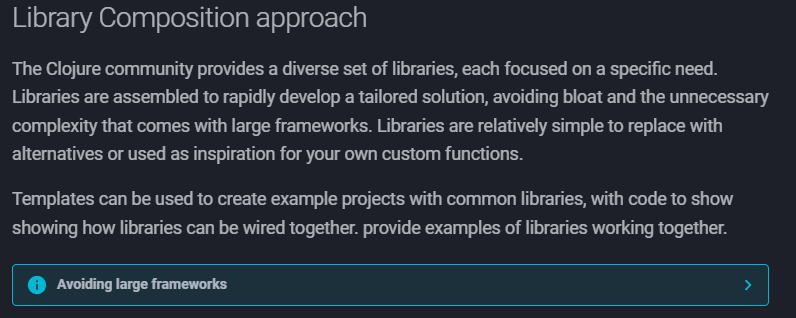

# about yesterday article idea

- the actual goal is to prepare the first step to "resurrect" the framework I built in the past, to make it open source
- the article was about kotlin because it used kotlin
- however, if I want to make that "framework" open source, I am now thinking to make it not just target Kotlin, but Java as well
  - however, the consideration is now even deeper because in some ways, compiled language such as Kotlin and Java is not the best suited for Test Automation which by nature, a fire and forget program, scripting
  - I think, the structure is possible to be implemented in other language
    - some ideas are: Javascript, Python, Clojure => they are script-like language 

because all of the above
- the article idea to focus on kotlin isn't really a step in the right direction
- so the new idea is to show what is possible, or what has been already possible by that framework that is called "icip"
  - but how do I do that?

things that needs to be considered later
- open source license
- code distribution
- and whether that "framework" is actually a framework at all
  - because of this mindset from : https://practical.li/clojure-web-services/#library-composition-approach
    

currently I am stuck, so I want to do livecoding instead

- requirement gathering...(?)
